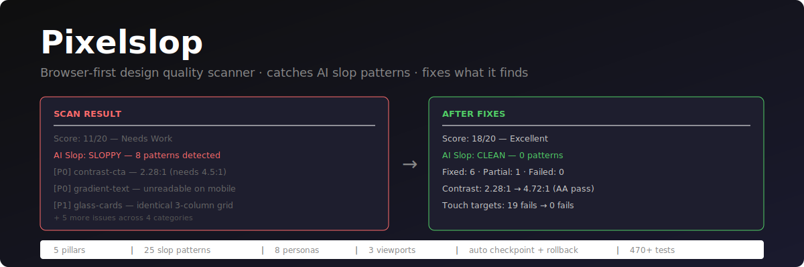

<p align="center"></p>

# Pixelslop

[](https://github.com/gabelul/pixelslop/actions/workflows/ci.yml)
[](https://www.npmjs.com/package/pixelslop)
[](LICENSE)
[](https://nodejs.org)

AI coding agents are incredible at generating interfaces. They're also incredible at generating the *same* interface — gradient text on a dark background, glass cards with glow shadows, Inter font everywhere, identical three-column feature grids, and CTAs that technically exist but nobody can actually read because the contrast is 2.3:1.

That's AI slop. It's not broken. It's not ugly. It's just... the same. Every time.

Pixelslop opens your actual pages in a real browser, screenshots them at three viewports, extracts computed styles, measures contrast ratios, checks 25 known AI slop patterns, scores design quality on 5 pillars, evaluates from 8 user personas, and fixes what it finds. It doesn't read your CSS and guess — it renders the page and measures what's actually there.

## Install

```bash
npx pixelslop install
```

Auto-detects Claude Code and Codex CLI, copies agent specs, configures Playwright MCP. Done.

> **Need:** [Claude Code](https://docs.anthropic.com/en/docs/claude-code) or [Codex CLI](https://github.com/openai/codex) installed first.

## Use it

```
/pixelslop http://localhost:3000
```

Or skip the URL — pixelslop finds running servers, detects static HTML sites, and asks before touching anything:

```
/pixelslop
```

It scores 5 pillars (Hierarchy, Typography, Color, Responsiveness, Accessibility), detects slop patterns, groups findings by priority, asks what you want to fix, then runs the fix loop with automatic checkpoints and rollback.

Full walkthrough: **[docs/getting-started.md](docs/getting-started.md)**

## How it fits with AI design tools

I built [stitch-kit](https://github.com/gabelul/stitch-kit) to teach AI agents how to generate beautiful UIs using Google Stitch. Pixelslop is the other side of that coin. Stitch-kit helps agents *create* good design. Pixelslop catches when they *didn't*. Together: generate with taste, verify with evidence, fix what slipped through.

## Docs

| Doc | What's in it |
|-----|-------------|
| **[Getting Started](docs/getting-started.md)** | Install, first scan, flags, static site support |
| **[Troubleshooting](docs/troubleshooting.md)** | `--debug` flag, session logs, common issues, filing bug reports |
| **[Architecture](docs/architecture.md)** | Agent roles, two-phase execution, subagent limitations, file layout |
| **[pixelslop-tools](docs/pixelslop-tools.md)** | Full CLI reference — plan, checkpoint, gate, discover, serve, log |
| **[Personas](docs/personas.md)** | Built-in personas, custom persona creation, JSON schema |
| **[Contributing](CONTRIBUTING.md)** | Adding patterns, fix guides, checkpoint protocol, persona system |

## Tests

```bash
npm test                 # 500+ tests, zero dependencies
npm run test:tools       # pixelslop-tools CLI
npm run test:installer   # installer unit tests
npm run test:orchestrator # agent spec validation
npm run test:persona     # persona schema validation
npm run validate         # resource file structure checks
```

## Releases

Automated via [release-please](https://github.com/googleapis/release-please). Conventional commits, auto-changelog, npm publish with OIDC provenance. `feat:` bumps minor, `fix:` bumps patch.

## Related

- **[stitch-kit](https://github.com/gabelul/stitch-kit)** — 35 skills that teach AI agents to generate beautiful UIs with Google Stitch. Pixelslop catches what slips through.
- **[slopbuster](https://github.com/gabelul/slopbuster)** — strips AI patterns from text and code. Same philosophy, different domain — pixelslop catches visual slop, slopbuster catches written slop.

## License

Apache 2.0 — see [LICENSE](LICENSE) and [NOTICE](NOTICE).

---

Built by [Gabi](https://booplex.com) @ [Booplex](https://booplex.com) — because AI agents are getting scary good at generating UIs, and someone needs to make sure "generated" doesn't mean "generic." Apache 2.0.
